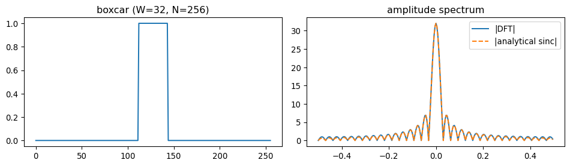

Fourier's theorem is arguably one of the most beautiful and profound results in mathematics. Loosely, it says that everything is made of waves: any sufficiently well-behaved function can be written as a superposition of sines and cosines, each pure and unmixed, that together reconstitute the whole. More precisely, the function is decomposed in the basis of complex exponentials $e^{ikx}$, each carrying a single frequency. Geometrically this is a change of basis in an infinite-dimensional vector space of functions; decomposition exposes the spectral content, and reconstruction sums the components back. The same idea recurs everywhere waves, vibrations, or repetitive structure appear: optics, quantum mechanics, signal and image processing, statistics, partial differential equations, crystallography.

## Four tools, one operation

In practice, four named tools come up depending on whether the time axis and the frequency axis are continuous or discrete (Appendix A is a side-by-side table including the forward and inverse formulas).

The **Fourier series** decomposes a function defined on a finite interval, or equivalently a periodic function on the real line. Continuous time, discrete frequency. The basis is countable: $e^{i 2\pi n x / L}$ for integer $n$.

The **complex Fourier series** is the same decomposition rewritten with $e^{ikx}$ in place of $\sin/\cos$ pairs via Euler's formula. The information is identical; only the bookkeeping changes.

The **Fourier transform** generalises to non-periodic functions on the whole real line. Both time and frequency are continuous. The sum becomes an integral, the coefficients become a continuous function $\tilde f(k)$.

The **discrete-time Fourier transform** (DTFT) handles aperiodic discrete sequences: discrete time, continuous and periodic frequency.

The **discrete Fourier transform** (DFT) is what computers actually compute. Both axes are discrete and finite, and both are treated as periodic by construction.

## Switching between them

The four tools are limits and discretisations of one another. Sampling a continuous signal at rate $\Delta t$ aliases frequencies above the Nyquist limit $1/(2\Delta t)$; truncating an infinite signal to $N$ samples convolves the true spectrum with a sinc, the source of spectral leakage. Sending the period of a Fourier series to infinity recovers the Fourier transform analytically (Appendix B). In practice, the DFT approximates the continuous transform whenever the signal is bandlimited below Nyquist and the window is wide enough to resolve the lowest frequency of interest.

## When the integral converges: $L^1$ vs $L^2$

For the Fourier transform integral $\int f(x)\,e^{-ikx}\,dx$ to make sense, $f$ must decay fast enough. Two standard sufficient conditions:

-   $f \in L^1$ means $\int |f(x)|\,dx < \infty$ --- *absolutely integrable*. The integral converges trivially because $|f(x)\,e^{-ikx}| = |f(x)|$.
-   $f \in L^2$ means $\int |f(x)|^2\,dx < \infty$ --- *finite energy*. Natural in physics, since $|f|^2$ is usually an energy or probability density. The transform exists in the Plancherel sense, and energy is preserved: $\int |f|^2\,dx = \frac{1}{2\pi}\int |\tilde f|^2\,dk$.

Functions in *neither* class --- like $f(x)=1$, $\sin x$, or $e^{ikx}$ itself --- have a Fourier transform only in the sense of distributions ($\delta$ functions, principal values).

## Are complex numbers physical?

No. A real signal can be analysed with sines and cosines alone, yielding a real amplitude and a separate phase. Complex exponentials are bookkeeping: they bundle amplitude and phase into one number, and they diagonalise differentiation ($\frac{d}{dx} e^{ikx} = ik\, e^{ikx}$), so every linear differential operator with constant coefficients becomes multiplication in Fourier space. The imaginary unit is convenient algebra, not a separate physical quantity.

## Two dimensions

A 2D Fourier transform decomposes an image into plane-wave gratings indexed by a wavevector $\mathbf{k} = (k_x, k_y)$. The magnitude $|\mathbf{k}|$ sets the spatial frequency; the angle of $\mathbf{k}$ encodes the orientation of the grating.

The 2D transform is just two 1D transforms in sequence. The kernel factorises, $e^{-i(k_x x + k_y y)} = e^{-ik_x x}\,e^{-ik_y y}$, so

$$\tilde f(k_x, k_y) = \int\!\!\int f(x,y)\,e^{-i(k_x x + k_y y)}\,dx\,dy = \int\left[\int f(x,y)\,e^{-ik_x x}\,dx\right] e^{-ik_y y}\,dy.$$

You take a 1D FT along $x$ for each fixed $y$, then a 1D FT along $y$ for each fixed $k_x$. The order doesn't matter (Fubini), and this generalises to any number of dimensions. It is exactly how `np.fft.fft2` is implemented --- row-wise FFTs followed by column-wise FFTs.

**A single spike at $\mathbf{r}_0$**: $f(\mathbf{r}) = \delta(\mathbf{r} - \mathbf{r}_0)$ has $\tilde f(\mathbf{k}) = e^{-i\mathbf{k}\cdot\mathbf{r}_0}$. The amplitude spectrum is *flat* --- every frequency is present with equal weight. All the position information is hidden in the phase. This is why a perfect point source carries the broadest possible spectrum and why deconvolving a point-spread function is a well-defined Fourier-domain operation.

**A pattern striped along $x$, constant along $y$**: $f(x,y) = \cos(k_0 x)$. The 2D FT factorises into $\delta(k_y) \cdot [\delta(k_x - k_0) + \delta(k_x + k_0)]$ (up to constants). The spectrum is two bright dots on the $k_x$ axis at $\pm k_0$, with nothing along $k_y$. The orientation of the stripes ($y$-invariant) shows up as the spectrum collapsing onto the perpendicular axis. Rotate the stripes in the image and the dot pair rotates by the same angle in the spectrum.

## Power spectrum as image similarity

The power spectrum $|F(\mathbf{k})|^2$ discards phase and keeps only how energy is distributed across spatial frequencies. Two photographs of the same texture --- sand, woven fabric, a thin section --- share a similar power spectrum even though they disagree pixel by pixel; two images of structurally different scenes do not. This makes the power spectrum a robust similarity measure where exact pixel correspondence is meaningless.

## Worked example: boxcar

The continuous Fourier transform of a rectangular pulse of width $W$ centred on the origin is $W\,\text{sinc}(kW/2\pi)$ (full derivation in Appendix C). The first zero is at $k = 2\pi/W$; side lobes decay as $1/k$. The narrower the pulse, the broader its spectrum --- the time--frequency uncertainty principle in its plainest form.

The DFT of a sampled boxcar approximates this, with deviations from the finite window and the implicit periodic wraparound:

``` python
import numpy as np
import matplotlib.pyplot as plt

N, W = 256, 32
x = np.zeros(N)
x[N // 2 - W // 2 : N // 2 + W // 2] = 1.0

X = np.fft.fftshift(np.fft.fft(x))
freq = np.fft.fftshift(np.fft.fftfreq(N))

k = 2 * np.pi * freq
sinc_analytical = W * np.sinc(k * W / (2 * np.pi))

fig, ax = plt.subplots(1, 2, figsize=(10, 3))
ax[0].plot(x); ax[0].set_title('boxcar (W=32, N=256)')
ax[1].plot(freq, np.abs(X), label='|DFT|')
ax[1].plot(freq, np.abs(sinc_analytical), '--', label='|analytical sinc|')
ax[1].set_title('amplitude spectrum'); ax[1].legend()
plt.tight_layout(); plt.show()
```



## What `fftshift` is for

`np.fft.fft` returns frequencies in *DFT order*: index $0$ is DC, indices $1\ldots N/2-1$ are the positive frequencies, and indices $N/2\ldots N-1$ are the negative frequencies (in increasing-from-most-negative order). This is efficient for the algorithm but counterintuitive to plot --- the spectrum looks split, with low frequencies at both ends. `np.fft.fftshift` rotates the array so that DC sits in the middle and frequencies run monotonically from $-f_\text{Nyq}$ to $+f_\text{Nyq}$. It is purely a reordering for human consumption: it does not change any value. Use it just before plotting; never use it before passing data back to `ifft`.

------------------------------------------------------------------------

## Appendix A --- the four tools side by side

|  | **Fourier series (FS)** | **Fourier transform (FT)** | **DTFT** | **DFT** |
|---------------|---------------|---------------|---------------|---------------|
| **time** | continuous, periodic on $[0,L]$ | continuous, $\mathbb{R}$ | discrete, $\mathbb{Z}$ | discrete, finite, periodic |
| **freq** | discrete, $k_n = 2\pi n/L$ | continuous, $\mathbb{R}$ | continuous, periodic on $[-\pi,\pi]$ | discrete, finite, periodic |
| **use when** | periodic signal, finite interval | aperiodic, finite energy | infinite sampled sequence | what computers actually compute |
| **forward** | $\displaystyle c_n = \frac{1}{L}\int_0^L f(x)\,e^{-i 2\pi n x / L}\,dx$ | $\displaystyle \tilde f(k) = \int_{-\infty}^{\infty} f(x)\,e^{-ikx}\,dx$ | $\displaystyle \tilde f(\omega) = \sum_{n=-\infty}^{\infty} f_n\,e^{-i\omega n}$ | $\displaystyle F_k = \sum_{n=0}^{N-1} f_n\,e^{-i 2\pi k n / N}$ |
| **inverse** | $\displaystyle f(x) = \sum_{n=-\infty}^{\infty} c_n\,e^{i 2\pi n x / L}$ | $\displaystyle f(x) = \frac{1}{2\pi}\int_{-\infty}^{\infty} \tilde f(k)\,e^{ikx}\,dk$ | $\displaystyle f_n = \frac{1}{2\pi}\int_{-\pi}^{\pi} \tilde f(\omega)\,e^{i\omega n}\,d\omega$ | $\displaystyle f_n = \frac{1}{N}\sum_{k=0}^{N-1} F_k\,e^{i 2\pi k n / N}$ |

## Appendix B --- from Fourier series to Fourier transform in the limit

Take a Fourier series on $[-L/2, L/2]$ and let $L \to \infty$. Define $k_n = 2\pi n/L$ so that $\Delta k = 2\pi/L$. The series

$$f(x) = \sum_{n} c_n\, e^{i k_n x}, \qquad c_n = \frac{1}{L}\int_{-L/2}^{L/2} f(x')\, e^{-i k_n x'}\, dx'$$

becomes, on substituting $c_n$ back,

$$f(x) = \sum_{n} \frac{\Delta k}{2\pi} \left[\int_{-L/2}^{L/2} f(x')\, e^{-i k_n x'}\, dx'\right] e^{i k_n x}.$$

As $L \to \infty$, $\Delta k \to 0$ and $k_n$ becomes a continuous variable. The Riemann sum becomes an integral, and the bracketed quantity converges to $\tilde f(k)$, giving

$$f(x) = \frac{1}{2\pi}\int_{-\infty}^{\infty} \tilde f(k)\, e^{ikx}\, dk,$$

which is the inverse Fourier transform. So the FT is literally a Fourier series with $L = \infty$.

## Appendix C --- Fourier transform of a boxcar

Let $f(x) = 1$ for $|x| \leq W/2$ and zero otherwise. Then

$$\tilde f(k) = \int_{-W/2}^{W/2} e^{-ikx}\, dx = \left[\frac{e^{-ikx}}{-ik}\right]_{-W/2}^{W/2} = \frac{e^{ikW/2} - e^{-ikW/2}}{ik}.$$

Using $\sin\theta = (e^{i\theta} - e^{-i\theta})/(2i)$,

$$\tilde f(k) = \frac{2\sin(kW/2)}{k} = W\cdot\frac{\sin(kW/2)}{kW/2} = W\,\text{sinc}\!\left(\frac{kW}{2\pi}\right),$$

where $\text{sinc}(u) := \sin(\pi u)/(\pi u)$ in the normalised convention used by NumPy. The first zero is at $k = 2\pi/W$; the central lobe has full width $4\pi/W$; subsequent zeros at $k = 2\pi n/W$; side lobes decay as $1/k$.
