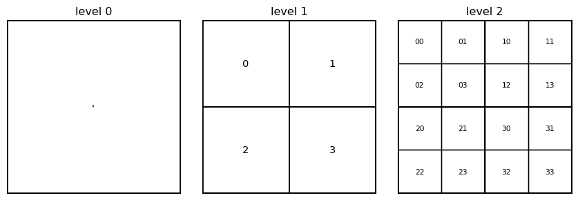
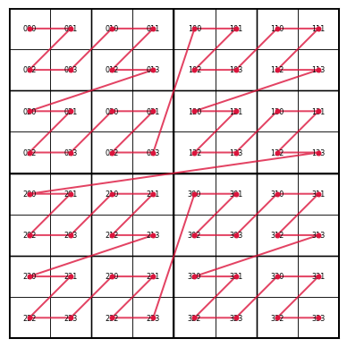

## A children's game

Two kids play a game. One says a number, the other has to say a bigger one. The second player wins if they can --- and the first seems doomed.

But there is a first move that wins on the spot:

> "**$i$**." (the square root of $-1$)

The second player cannot answer. There is no "bigger" complex number. The order relation `a < b` that works on the real line **does not exist on the 2-D plane**.

This is the trick that every Earth-observation database has to solve.

## The same problem on a sphere

A 1 km cell in Estonia has neighbours to the north, south, east, west --- none of them is "next". Disk and cloud storage are 1-D: bytes arranged in a line, fast at sequential reads, slow at scattered ones. To put Earth on a disk you need a 1-D order over a 2-D surface, and the children's-game theorem tells us no such order is geometrically perfect.

It can be almost perfect, though. A **space-filling curve** is a 1-D path that snakes through every cell of a 2-D surface so that consecutive cells are usually adjacent in space. "Usually" because the curve has to fold occasionally --- but the folds can be arranged to be rare and short.

A Discrete Global Grid System (DGGS) is a hierarchical tessellation of the sphere whose cells are addressed by integers along such a curve. Two superpowers come for free if you build it right:

1.  **Sorted by integer ID ⇒ sorted by space.** A query "give me all data in this region" becomes a handful of contiguous reads.
2.  **Parent--child by prefix.** Drilling down through resolutions is a bit-shift, not a geometric computation.

The rest of this post is about how that works, starting from the simplest possible case.

## The simplest hierarchical index: quadtree on a square

Start with a unit square. Split it into 4 quadrants, label them `0,1,2,3`. To go finer, split each quadrant into 4 again, and append a digit.

<details class="code-fold">
<summary>Code</summary>

``` python
import matplotlib.pyplot as plt
import matplotlib.patches as patches

CONV = {0: (0, 1), 1: (1, 1), 2: (0, 0), 3: (1, 0)}  # digit → (bx, by) corner

def draw_quadtree(ax, level, max_level, x0=0, y0=0, size=1.0, path=""):
    """Recursively draw a quadtree and annotate each cell with its path."""
    ax.add_patch(patches.Rectangle((x0, y0), size, size, fill=False,
                                    edgecolor='black', linewidth=max(0.5, 2 - 0.5*level)))
    if level == max_level:
        ax.text(x0 + size/2, y0 + size/2, path or "·",
                ha='center', va='center', fontsize=max(6, 14 - 3*level))
        return
    for digit, (bx, by) in CONV.items():
        draw_quadtree(ax, level + 1, max_level,
                       x0 + bx * size/2, y0 + by * size/2, size/2, path + str(digit))

fig, axes = plt.subplots(1, 3, figsize=(9, 3))
for ax, max_level in zip(axes, [0, 1, 2]):
    draw_quadtree(ax, 0, max_level)
    ax.set_xlim(0, 1); ax.set_ylim(0, 1)
    ax.set_aspect('equal'); ax.set_xticks([]); ax.set_yticks([])
    ax.set_title(f"level {max_level}")
plt.tight_layout()
plt.show()
```

</details>

<figure>

<figcaption aria-hidden="true">A quadtree at three levels of refinement, with each cell labelled by its base-4 path from the root.</figcaption>
</figure>

A cell at level $r$ is identified by a string of $r$ base-4 digits --- a **path** from the root through the tree:

-   `""` is the whole square (root, level 0).
-   `"2"` is the bottom-left quadrant.
-   `"23"` is the bottom-right corner of the bottom-left quadrant.

Now imagine following the cells in path order from `"00"` through `"33"`. The line connecting their centres traces the **Z-order space-filling curve**:

<details class="code-fold">
<summary>Code</summary>

``` python
import numpy as np

def path_to_centre(path: str) -> tuple[float, float]:
    """
    Convert a quadtree path to the (x, y) centre of the cell.
    """
    x, y, s = 0.5, 0.5, 1.0
    for d in path:
        s /= 2
        bx, by = CONV[int(d)]
        x += (bx - 0.5) * s
        y += (by - 0.5) * s
    return x, y

LEVEL = 3
paths = [f"{i:0{LEVEL}}" for i in range(4**LEVEL)]
# generate paths in base-4 order
paths = []
def gen(prefix, depth):
    if depth == 0:
        paths.append(prefix); return
    for d in range(4):
        gen(prefix + str(d), depth - 1)
gen("", LEVEL)

xs, ys = zip(*(path_to_centre(p) for p in paths))

fig, ax = plt.subplots(figsize=(5, 5))
draw_quadtree(ax, 0, LEVEL)
ax.plot(xs, ys, color='crimson', linewidth=1.5, alpha=0.8)
ax.scatter(xs, ys, color='crimson', s=12, zorder=3)
ax.set_xlim(0, 1); ax.set_ylim(0, 1)
ax.set_aspect('equal'); ax.set_xticks([]); ax.set_yticks([])
plt.show()
```

</details>

<figure>

<figcaption aria-hidden="true">Cells of a level-3 quadtree connected in path order. The curve fills the square in a recursive Z shape.</figcaption>
</figure>

This is the entire story in one picture. The cells are 2-D objects but their integer IDs (read as base-4 numbers) put them in an order that mostly respects spatial proximity. Where the curve "jumps" --- once per level boundary --- neighbouring cells in space end up far apart in the index. Those jumps are unavoidable; the [bigger-number paradox](#the-childrens-game) guarantees them.

### The parent--prefix property

The defining feature of this scheme:

> **A parent's path is a prefix of all its children's paths.**

Cell `"23"` is the parent of `"230"`, `"231"`, `"232"`, `"233"`. Three direct consequences:

-   **Parent extraction.** Drop the last digit. No lookup, no rounding.
-   **Range containment.** All descendants of `"23"` form a *contiguous range* when sorted lexicographically. Zoom queries map to range reads.
-   **Spatial locality follows automatically.** Sorted = grouped by parent = compact in space.

Property 2 is what makes parent-aligned Zarr chunking and DGGS-on-cloud-storage work at all. The geometry is encoded in the integer order.

## Quadtree path ≡ Morton code

The bit-interleaved representation of an $(x, y)$ coordinate is the **Morton code**. It is the same data as the quadtree path, written out as a binary integer:

``` python
def morton_encode(x: int, y: int, bits: int = 8) -> int:
    """
    Interleave the bits of x and y. y goes into odd positions, x into even.
    """
    m = 0
    for i in range(bits):
        m |= ((x >> i) & 1) << (2 * i)
        m |= ((y >> i) & 1) << (2 * i + 1)
    return m

# A 3-digit quadtree path "230" corresponds to integer 0b10_11_00 = 44
print(f"path '230'  →  Morton {morton_encode(1, 6, 3):06b} (binary) = {morton_encode(1, 6, 3)} (decimal)")
```

    path '230'  →  Morton 101001 (binary) = 41 (decimal)

So *a quadtree path is a Morton code is a 1-D index into a 2-D grid*. Three names, one mathematical object.

Now the practical question: **how do you store a path in a computer**? The natural answer is "a string of digits". The interesting answer is "a single integer". The interesting answer wins by three orders of magnitude in real applications, and the reason why is what the rest of this post is about.

## How to fit a path into one integer

A path of 20 base-4 digits is 20 × 2 bits = 40 bits --- fits comfortably in a 64-bit integer with room to spare. Pack the digits side by side:

    bit:    63 62 ... 41 40 | 39 38 | 37 36 | ... | 1 0
    field:   reserved        digit 1 digit 2        digit 20
                             (2 bits each)

Reading digit $i$ is a shift-and-mask. Writing digit $i$ is a clear-and-or. Both are single CPU instructions on modern hardware.

``` python
def get_digit(packed: int, i: int, depth: int) -> int:
    """
    Extract the i-th base-4 digit (0 = root level) from a packed path.
    """
    shift = 2 * (depth - 1 - i)
    return (packed >> shift) & 0b11

def set_digit(packed: int, i: int, depth: int, new_digit: int) -> int:
    """
    Replace the i-th base-4 digit in place.
    """
    shift = 2 * (depth - 1 - i)
    mask  = 0b11 << shift
    return (packed & ~mask) | (new_digit << shift)

# pack path "2310"
packed = 0
for d in [2, 3, 1, 0]:
    packed = (packed << 2) | d
print(f"path 2310  →  packed = 0b{packed:08b} = {packed}")
print(f"digit 0    →  {get_digit(packed, 0, depth=4)}")
print(f"digit 2    →  {get_digit(packed, 2, depth=4)}")
```

    path 2310  →  packed = 0b10110100 = 180
    digit 0    →  2
    digit 2    →  1

So far so clean. Now consider a level-2 path stored in the same fixed-width slot:

    slot:   1  2  3  4  5  6 ... 20
    digit:  2  3  ?  ?  ?  ? ...  ?     ← what goes here?

You must put *something* in slots 3 to 20. There are no empty bits. Two options:

**Option A --- fill with zeros.** But then `"23" + zeros` is bit-for-bit identical to `"2300000…"`, a level-20 descendant of `"23"` whose path happens to be zero from digit 3 on. **Zero is a valid path digit**, so you cannot tell a level-2 cell apart from one specific level-20 cell. Length is no longer recoverable from the integer alone.

**Option B --- store the resolution in a separate field.** Works, but costs bits (5 of them to store 0--20) and every operation has to read two fields.

There is a third option that is cheaper than both, and it is the trick that makes DGGS indexing fast: use a digit value that **is not a valid path digit** as a sentinel marking "end of path".

For Z7 (the index used by the IGEO7 hexagonal aperture-7 DGGS) the path digits are 0--6 and the sentinel is **7 = 0b111**. The bit budget happens to be perfect: 8 values, 3 bits per slot, no waste.

    slot:   1  2  3  4  5  6  7  ... 20
    digit:  2  3  7  7  7  7  7  ...  7      ← sentinel = "no more path"

    get_resolution = position of the first 7

Now resolution, path, and end-of-path all live in one integer. Sorting works, prefix queries work, parent extraction is a bit mask. The sentinel is the single design decision that makes the bit-packed representation self-contained.

## Why not just use strings?

The string representation is excellent for humans:

    "023000"   # base cell 0, then path 2-3-0-0-0, resolution 5

It is unreadable as an integer:

    3891391553024819199

But the integer is what the *computer* wants. Concrete cost comparison for a million cells:

| Property                   | `uint64` array    | Python string array     |
|----------------------------|-------------------|-------------------------|
| Memory                     | 8 MB              | ~50--100 MB             |
| Cache behaviour            | L1/L2 friendly    | scattered across heap   |
| Parent = drop last digit   | 2 bit operations  | substring slice (alloc) |
| Compare two indices        | 1 CPU instruction | byte-by-byte loop       |
| Hash for dict / set        | identity          | walk every byte         |
| Numba / SIMD vectorisation | yes               | no                      |
| Sort 10⁸ items             | seconds           | minutes                 |

The pattern that emerges across every serious DGGS implementation: **store and compute on `uint64` arrays; convert to strings only when crossing a human-facing boundary** (printing, debugging, REST APIs, dataset metadata). The string is the *view*; the integer is the *representation*.

If you want to know **why** integers crush strings by orders of magnitude on identical data, the appendix below has the gentlest intro I can write.

## Where this lands

Z7 packs a Sentinel-flagged base-7 path into a `uint64`. Sorted Z7 IDs trace a space-filling curve over the sphere. Chunks aligned with parent zones at a coarser resolution map to contiguous storage in [Zarr](https://zarr.dev). Neighbour queries reduce to **digit-wise addition with carry** using tiny precomputed lookup tables --- the same elementary operation as decimal long addition, lifted to a hexagonal grid (the algebraic structure is called **Generalised Balanced Ternary** but the spirit is unchanged).

The lesson is short: the children's-game theorem forces us to invent a 1-D order for 2-D data. Once invented, the rest of the system --- fast neighbours, fast queries, cloud-friendly storage --- falls out of one good choice of how to write the cell ID down as bits.

------------------------------------------------------------------------

## Appendix --- what's actually happening inside the computer

This is the minimum you need to understand why bit operations on `uint64` arrays are so much faster than the equivalent string operations. Skip if you already know.

### The CPU is much faster than memory

A modern CPU core executes a few billion instructions per second. Main memory (RAM) responds in about **100 nanoseconds** per access --- that's a thousand wasted clock cycles for every memory read that misses the cache. To paper over this gap, the CPU has a small fast memory between itself and RAM, called the **cache**.

The cache has three levels:

| Level | Size            | Latency |
|-------|-----------------|---------|
| L1    | ~32 KB per core | 1 ns    |
| L2    | ~256 KB         | 3 ns    |
| L3    | a few MB        | 10 ns   |
| RAM   | gigabytes       | ~100 ns |

A program that fits its working data in L1 runs roughly 100× faster than one that constantly misses to RAM. This is "the memory wall", and it dominates modern performance.

### Data layout matters more than algorithms

The cache transfers data in **lines** of 64 bytes (eight `uint64`s, or a few hundred characters of a string object). When you read one byte the CPU reads its 63 neighbours for free, betting that you'll want them soon. This is why **contiguous arrays** are so much faster than linked structures: if your million `uint64`s live next to each other in memory, the CPU's **prefetcher** can pull the next batch into L1 *while you're still working on the current batch*. Free parallelism.

A Python list of strings, by contrast, looks like this in memory:

    list ─→ [ptr] [ptr] [ptr] [ptr] [ptr] ...     ← one contiguous array of pointers

    each ptr ─→ String object somewhere on the heap:
                  ┌──────────────┐
                  │ header bytes │   (refcount, type, length, hash cache: ~50 bytes overhead)
                  │  string data │   (the actual characters)
                  └──────────────┘

To process one string the CPU has to: read the pointer (cache hit, fine), follow the pointer to the heap (probably a miss --- strings can be allocated anywhere), read the header (another miss), finally read the bytes. **Five cache misses** instead of zero. The prefetcher cannot help because the destinations are scattered.

### Why bit operations are so cheap

A bit shift, AND, OR, XOR is a single CPU instruction operating entirely inside the CPU's registers --- no memory access at all. They cost **one clock cycle**, and the CPU can usually execute several per cycle in parallel. A pipeline of `(packed & mask) | (new << shift)` reduces to three register operations and zero memory touches.

Compare to the string equivalent, "drop the last character and append a sentinel digit":

1.  Allocate a new string object on the heap (call malloc, update refcounts).
2.  Copy the original bytes into it.
3.  Append the sentinel byte.
4.  Return the new pointer.
5.  Eventually the garbage collector frees the old one.

Hundreds of instructions, several memory allocations, cache pollution, and garbage to clean up --- for an operation that takes one instruction on a packed integer.

### SIMD and Numba

Modern CPUs have wide registers (256 or 512 bits) that can hold **four or eight `uint64`s at once** and execute the same operation on all of them in one instruction. This is **SIMD** (Single Instruction, Multiple Data). NumPy uses it automatically on uint64 arrays; Numba's `@njit` compiler emits the same kind of code for explicit loops. The result is that 4--8 cells are processed per clock cycle.

SIMD cannot work on strings because the elements have variable length and indirect storage --- the very flexibility that makes strings convenient is what blocks the speedup.

### The pattern

Add it up:

-   **Memory layout:** `uint64[N]` is one contiguous block. Strings are scattered.
-   **Cache hits:** prefetcher loves contiguous data; chokes on pointer chasing.
-   **Instructions:** bit ops are 1 cycle, string ops are hundreds.
-   **SIMD:** uint64 arrays are vectorisable; strings are not.

These factors multiply, not add. A 10× improvement in each gives ten thousand×. In practice the gap on DGGS-scale workloads is somewhere between 100× and 10000×, depending on how much of the computation is in the hot loop.

That is the entire reason DGGS code looks the way it does: bit-packed integers, lookup tables, Numba kernels, and string conversions only at the human boundary. The geometry is interesting; the engineering is "stay in registers".
